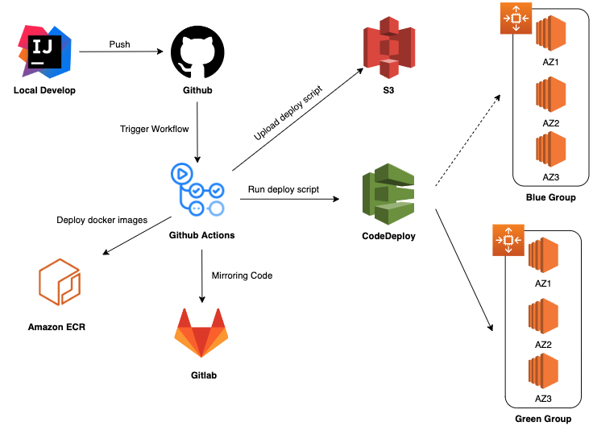

# CS-Broker

CS 문제를 공부하고 풀이할 수 있는 CS Broker 서비스를 위한 서버입니다.

## 사용 기술
Spring Boot, Kotlin, Gradle, JPA, Docker, Redis, MariaDB, AWS

## Infra Structure

### 컴포넌트 구성도

### CI/CD

### VPC 구성도

## 개발 과정

- [Spring Data JPA @Repository 어노테이션 자세히 알아보기](https://velog.io/@kshired/Spring-%EC%99%9C-JPARepository%EB%8A%94-Repository%EA%B0%80-%ED%95%84%EC%9A%94-%EC%97%86%EC%9D%84%EA%B9%8C-deep-dive-%ED%95%B4%EB%B3%B4%EA%B8%B0)
- [AOP를 통하여 반복작업 제거하기](https://velog.io/@kshired/Spring-AOP%EB%A5%BC-%EC%9D%B4%EC%9A%A9%ED%95%98%EC%97%AC-%EB%B0%98%EB%B3%B5%EC%9E%91%EC%97%85-%EC%A4%84%EC%9D%B4%EA%B8%B0)
- [Exception을 처리하기 위한 방안](https://velog.io/@kshired/Spring-Exception-%ED%95%B4%EA%B2%B0-%EC%A0%84%EB%9E%B5)
- [CI/CD를 Github Action을 통해 구축하기](https://velog.io/@monstera/Infra-Github-actions%EB%A5%BC-%ED%86%B5%ED%95%B4-CICD-%EC%9D%B8%ED%94%84%EB%9D%BC-%EA%B5%AC%EC%B6%95%ED%95%98%EA%B8%B0)
- [Spring에서 비밀값 관리하기](https://velog.io/@kshired/Spring-yml-%EC%84%A4%EC%A0%95-%ED%8C%8C%EC%9D%BC-%EA%B4%80%EB%A6%AC%ED%95%98%EA%B8%B0)
- [Gitmoji를 커밋 컨벤션으로 사용하기](https://velog.io/@kshired/Gitmoji%EB%A5%BC-%EC%BB%A4%EB%B0%8B-%EC%BB%A8%EB%B2%A4%EC%85%98%EC%9C%BC%EB%A1%9C-%EC%82%AC%EC%9A%A9%ED%95%98%EA%B2%8C-%EB%90%9C-%EC%9D%B4%EC%9C%A0)

## Documentation

- https://docs.csbroker.io/
